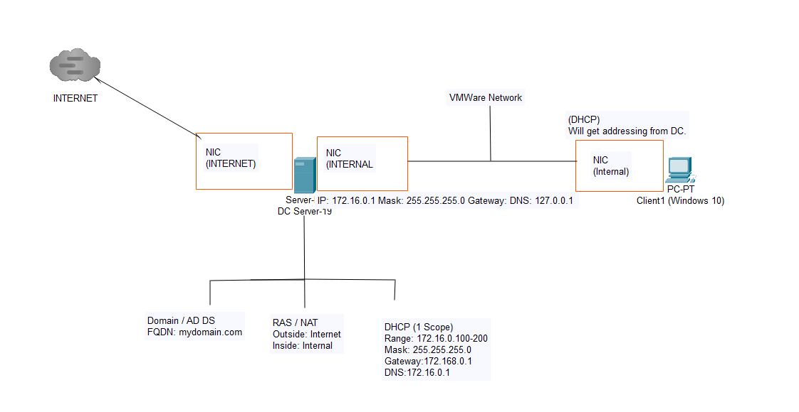
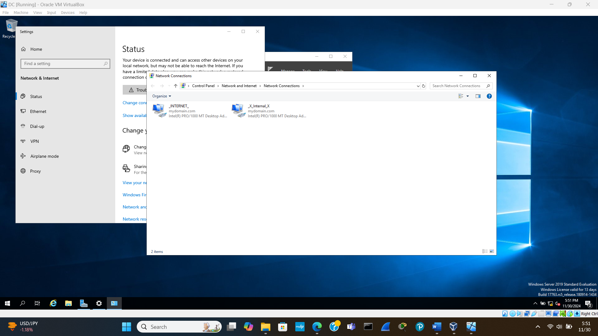
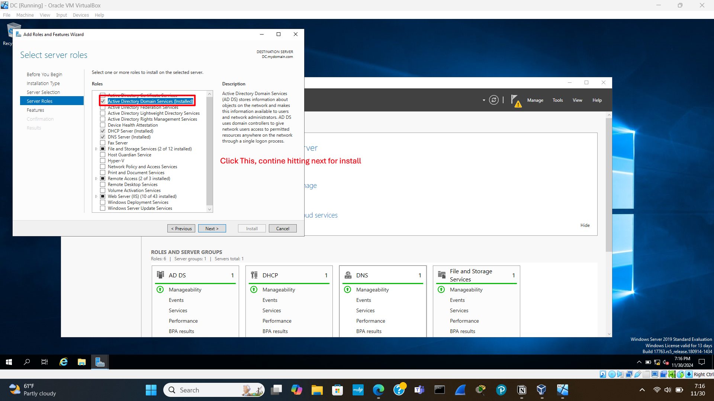
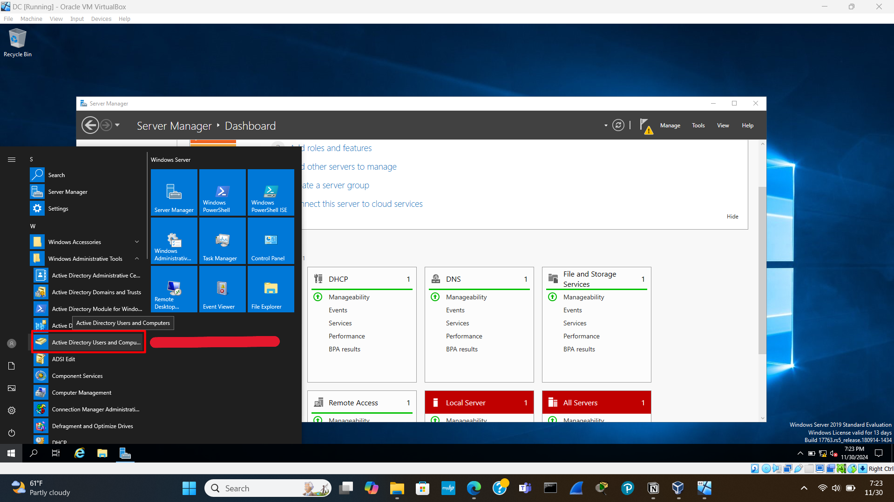
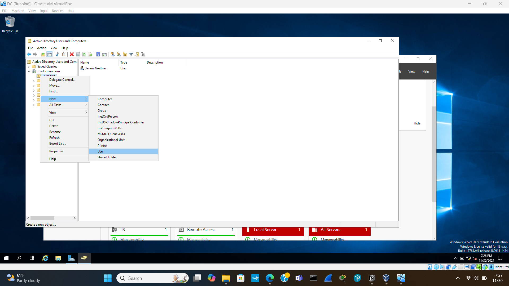
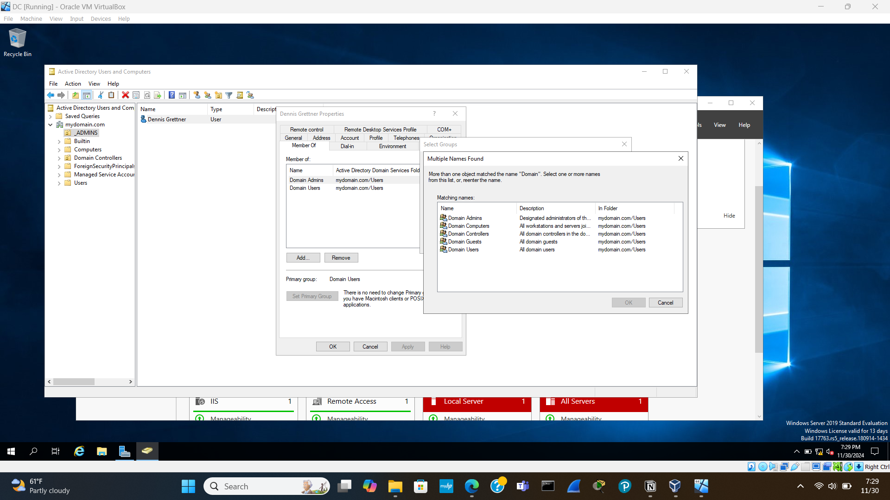
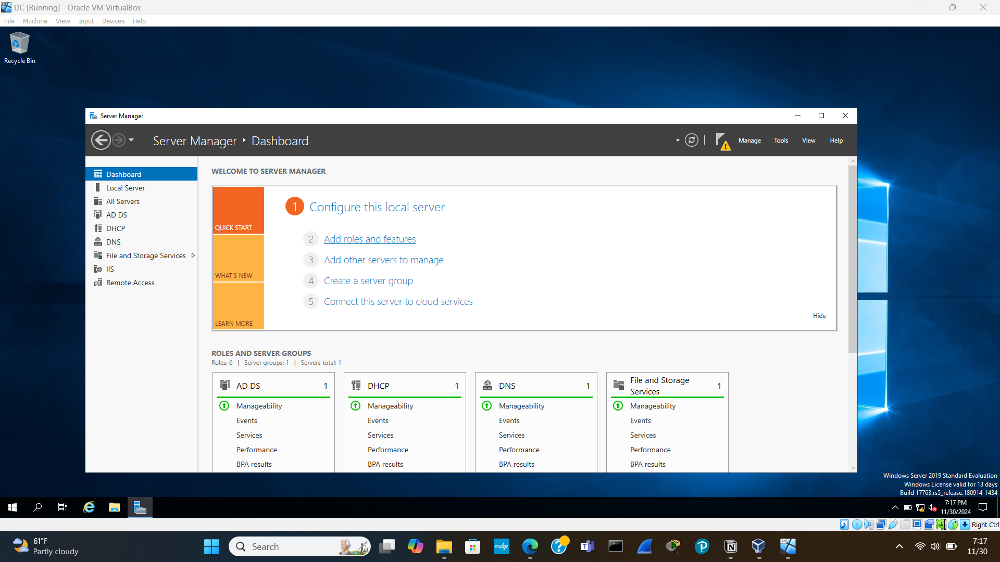

# Active-Directory Set-Up

# Topology

I downloaded Windows 10 ISO and Windows Server 2019 ISO

I began by setting up the Windows Server 2019 as a virtual machine. After setting up the box on virtual box, I proceeded to boot up and install windows 2019 server. The operating system I opted to install is the Standard Evaluation(Desktop Experience). This way I have the GUI to work with. I then opted for the custom install to format the hard drive and install from scratch. The first screen that appeared after the box reboot prompted for a password. This is the default server administrator account. I then installed the VM guest additions through virtualbox then I shutdown the VM. 

# Set-up IP Addressing

The first step is to set up the IP addressing. I went into the network settings and changed the adapter options. I then went into the IPv4 setting for the first of 2 adapters and looked at the address that was assigned from the installation process. I had opted during installation to have internet connectivity. This first NIC card displayed an IP address that matched the same network address and subnet mask that my physical machine uses for the internet. I then changed the name of this NIC card to INTERNET, in order to reflect that this NIC has a configuration that allows for access to the internet. This NIC is retrieving its IP address configuration from DHCP. In the IPv4 properties of the 2nd NIC card I noticed it was assigned a different address reflecting one that does not have access to the internet, so I then assigned it a name of INTERNAL. I then set the IP address of the internal NIC to match that of the topology above. This server is using itself as the DNS server. I entered 127.0.0.1 to identify it as using itself.

Next up, I installed the active directory and created a domain. At the Server Manager Dashboard I clicked on add roles and features. I select the server where I want to install the active directory domain services and check mark it appropriately and hit next through to its install option. Following this at the top right of the dashboard I clicked the caution sign in order to set up the post-deployment configuration.

# Adding a User and assigning privileges

Next i clicked start menu and select Active Directory User and Computers.

I then right-click on mydomain, select New and then Organizational Unit. I am going to Create a OU for ADMINS. A folder is then created.

I then right-click on the newly created ADMINS folder and select New and select User. I name the user and assign a user logon name. Then i set a password and I uncheck “user must change password at next logon”. Now I am going to make my new user account an admin account. I right click the user and click on properties. I then click on the “member of” tab and under the names to check box, I type in Domain Admins and hit check names. I then hit apply and now I have a User that has Domain Admins privilege. I can now use this user to login and have these privileges. See below.

# Installing RAS / NAT

To do this I click on Add Roles and Features at the Dashboard Screen and under the Server Roles tab I select Remote Access and then hit Next until i can select “Routing” and then add the feature. And then Install. When it is finished installing, I click on the “tools” drop down menu at the top right of the dashboard screen. I then select Routing and Remote Access. Next I right-click on DC (local) and select Configure and Enable Routing and Remote Access. Then I select Network address and translation (NAT). I select the interface that I want to use to connect to the internet and hit next. Now my DHCP on the server is configured.

# DHCP Server

On the dashboard, I click on add roles and features. Select DHCP and add features. Next, I go to tools and DHCP where I will setup my DHCP scope. I click the drop down under my DHCP server and right click on IPv4 and then New Scope. I then name the new scope. I then input the start address and end address per my logical topology. I then enter the domain controllers IP address for the internal NIC. Then I right click the DHCP server and select authorize and then refresh it.

