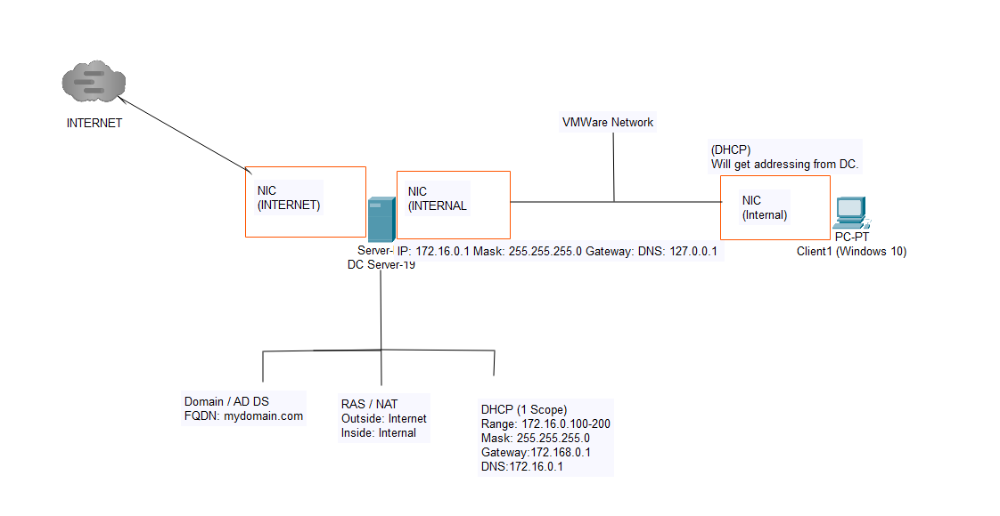
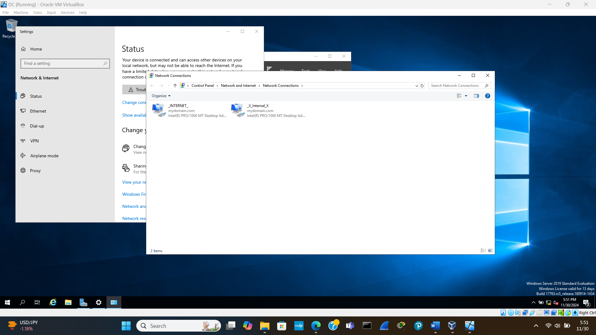
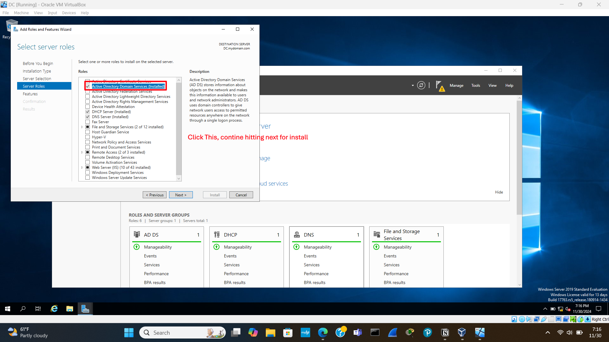
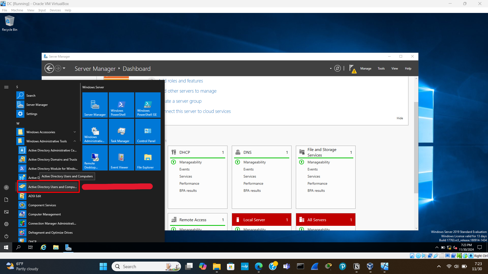
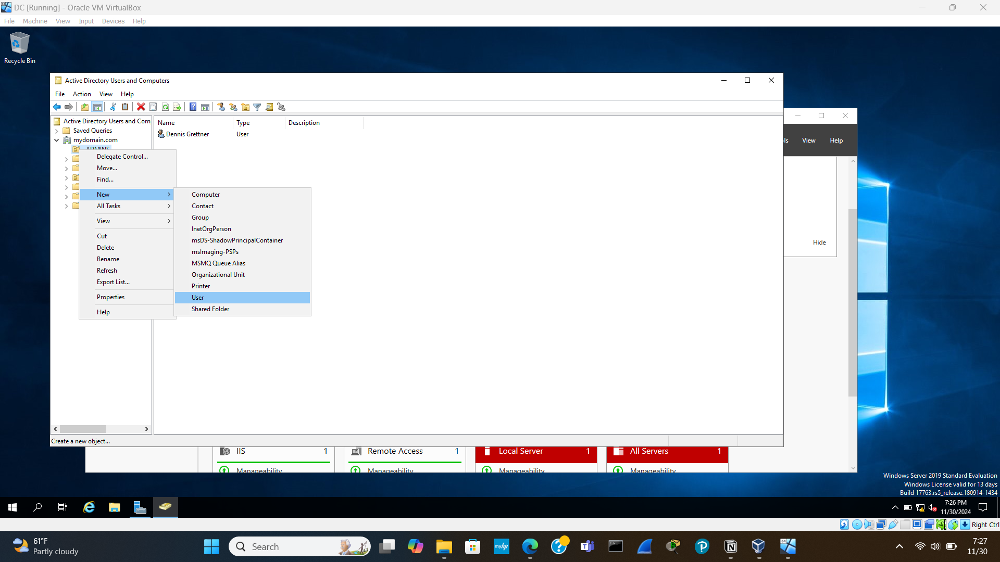
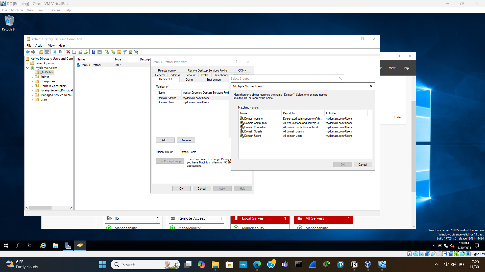
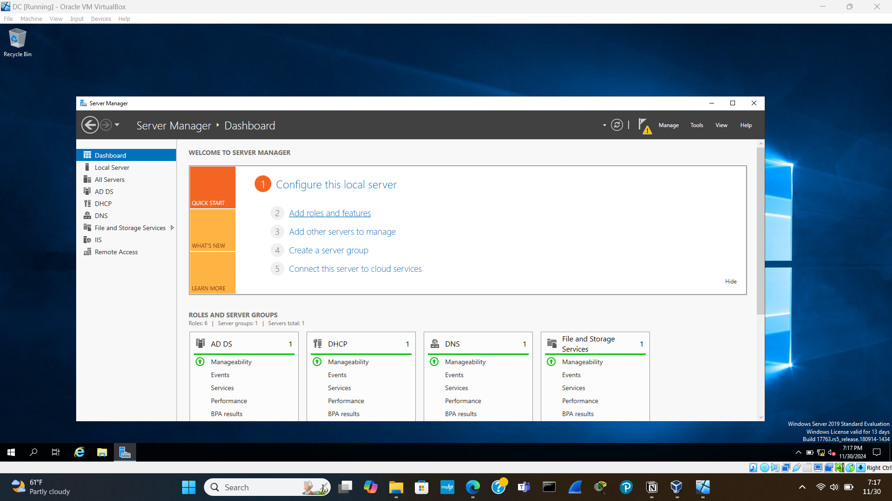

# Active-Directory-Lab

---

## Objective

---

The objective of this lab was to set up an Active Directory environment on a virtual machine running Windows Server 2019, configure network settings, create and manage user accounts and organizational units, and install and configure essential network services such as Remote Access Services (RAS), Network Address Translation (NAT), and DHCP. Through this lab, various technical skills were demonstrated, including virtualization, operating system installation, IP addressing, Active Directory management, and network configuration.

## Skills Learned

---

- **Virtualization:** setting up and managing virtual machines using VirtualBox.
- **Operating System Installation:** Installing and configuring Windows Server 2019.
- **IP Addressing:** Configuring network adapters and IP settings.
- **Active Directory:** Installing and Configuring Active Directory Domain Services.
- **User Management:** Creating and managing user accounts.
- **Remote Access Setup:** Installing and configuring RAS/NAT.
- **DHCP Server Setup:** Configuring DHCP Scope and Settings.
- **Networking:** Understanding and configuring DNS, DHCP, and NAT settings.

## Tools Used

---

- VirtualBox for creating and managing virtual machines.
- Windows Server 2019 ISO for the operating system installation on the virtual machine.
- Server Manager for adding roles and features, such as Active Directory Domain Services and DHCP.
- Active Directory Users and Computers for managing users and organizational units within Active Directory.
- Routing and Remote Access for configuring Remote Access Services (RAS) and Network Address Translation (NAT).
- DHCP Tool for setting up and managing the DHCP server.
- Network Settings for configuring IP addresses and network adapters.

## Steps

---

# Topology

---

# Initial Setup

---

1. **ISO Downloads**: Downloaded Windows 10 ISO and Windows Server 2019 ISO.
2. **Virtual Machine Setup**: Deployed Windows Server 2019 as a virtual machine using VirtualBox.
    - **Installation**: Booted and installed Windows Server 2019 (Standard Evaluation with Desktop Experience for GUI).
    - **Configuration**: Opted for a custom install, formatted the hard drive, and installed from scratch.
    - **Initial Login**: Set up the default server administrator account with a password.
    - **VM Guest Additions**: Installed VM Guest Additions through VirtualBox and then shut down the VM.

# IP Address Configuration

---

### Steps to Configure IP Addressing

---

1. **Network Settings**: Accessed network settings to change adapter options.
2. **Adapter Configuration**:
    - **Adapter 1 (INTERNET)**: Ensured internet connectivity and noted DHCP-assigned IP address and subnet mask matching the physical machine's network.
    - **Adapter 2 (INTERNAL)**: Identified a different IP address reflecting no internet access. Renamed NIC to INTERNAL.
3. **Static IP Assignment**: Assigned the internal NIC an IP address as per the topology. Set the DNS server to 127.0.0.1 (the server itself).

# Active Directory and Domain Creation

---

### Steps to Configure Active Directory Installation and Domain Creation

---

1. **Server Manager Dashboard**:
    - **Add Roles and Features**: Selected the server and checked the Active Directory Domain Services option.
    - **Post-Deployment Configuration**: Clicked on the caution sign to set up post-deployment configuration.

# User Creation and Privilege Assignment

---

### Steps to Add User and Assign Privileges

---

1. **Accessing Active Directory**:
    - **Active Directory Users and Computers**: From the Start menu, selected Active Directory Users and Computers.
2. **Creating Organizational Unit (OU)**:
    - **New OU for Admins**: Right-clicked on mydomain, selected New -> Organizational Unit, and named it "ADMINS".
3. **Creating and Configuring New User**:
    - **New User**: Right-clicked on the ADMINS folder, selected New -> User, entered the user details and logon name.
    - **Password Setup**: Assigned a password and unchecked "User must change password at next logon".
    - **Admin Privileges**: Added the user to "Domain Admins" under the "Member Of" tab.

# Installing RAS / NAT

---

### Steps to Install Remote Access Services (RAS) and NAT

---

1. **Add Roles and Features**:
    - **Server Roles**: Selected Remote Access, then continued to select "Routing" and installed the feature.
2. **Configure Routing and Remote Access**:
    - **Dashboard Tools**: From the dashboard tools menu, selected Routing and Remote Access.
    - **Configuration**: Right-clicked on DC (local), selected Configure and Enable Routing and Remote Access, chose Network Address Translation (NAT), and selected the internet interface for connection.

# DHCP Server Configuration

---

### Steps to Configure DHCP

---

1. **Add Roles and Features**:
    - **DHCP Role**: Selected DHCP and added features.
2. **DHCP Setup**:
    - **Tools and DHCP**: Accessed the DHCP tool, configured the DHCP scope by right-clicking on IPv4 and selecting New Scope.
    - **Scope Details**: Entered the start and end address per the logical topology, and set the domain controller's IP for the internal NIC.
    - **Authorization**: Authorized the DHCP server and refreshed it.
